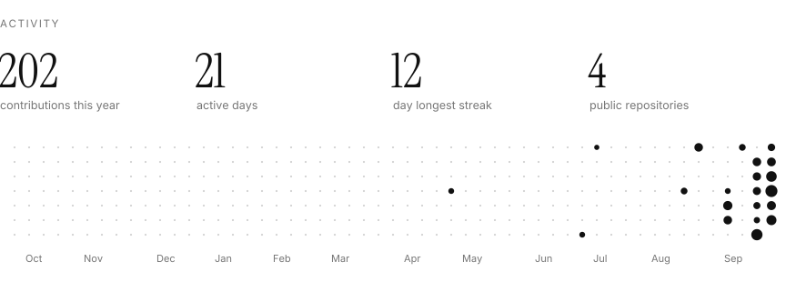
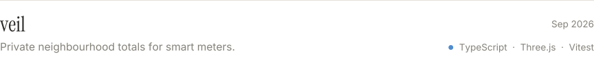
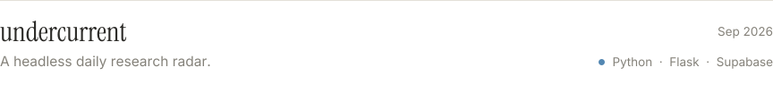
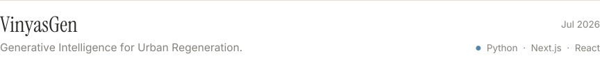
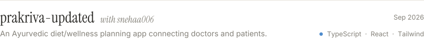

<!-- Generated by scripts/build.py. Change config.json or the script, not this file. -->

<picture><source media="(prefers-color-scheme: dark)" srcset="assets/header-dark.svg"></picture>

<picture><source media="(prefers-color-scheme: dark)" srcset="assets/activity-dark.svg"></picture>

<picture><source media="(prefers-color-scheme: dark)" srcset="assets/stack-dark.svg"></picture>

<picture><source media="(prefers-color-scheme: dark)" srcset="assets/work-dark.svg"></picture>
<a href="https://github.com/333shubh/veil"><picture><source media="(prefers-color-scheme: dark)" srcset="assets/project-veil-dark.svg"></picture></a>
<a href="https://github.com/333shubh/folio-"><picture><source media="(prefers-color-scheme: dark)" srcset="assets/project-folio-dark.svg"></picture></a>
<a href="https://github.com/333shubh/undercurrent"><picture><source media="(prefers-color-scheme: dark)" srcset="assets/project-undercurrent-dark.svg"></picture></a>
<a href="https://github.com/333shubh/VinyasGen"><picture><source media="(prefers-color-scheme: dark)" srcset="assets/project-vinyasgen-dark.svg"></picture></a>
<a href="https://github.com/ayushswamy30/MirrorSpace"><picture><source media="(prefers-color-scheme: dark)" srcset="assets/project-ayushswamy30-mirrorspace-dark.svg"></picture></a>
<a href="https://github.com/snehaa006/prakriva-updated"><picture><source media="(prefers-color-scheme: dark)" srcset="assets/project-snehaa006-prakriva-updated-dark.svg"></picture></a>
<picture><source media="(prefers-color-scheme: dark)" srcset="assets/rule-dark.svg"></picture>

<a href="https://www.linkedin.com/in/shubhjadiya/"><picture><source media="(prefers-color-scheme: dark)" srcset="assets/link-linkedin-dark.svg"></picture></a>

