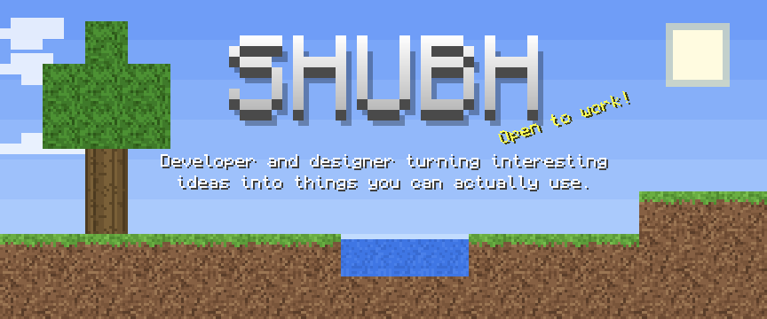
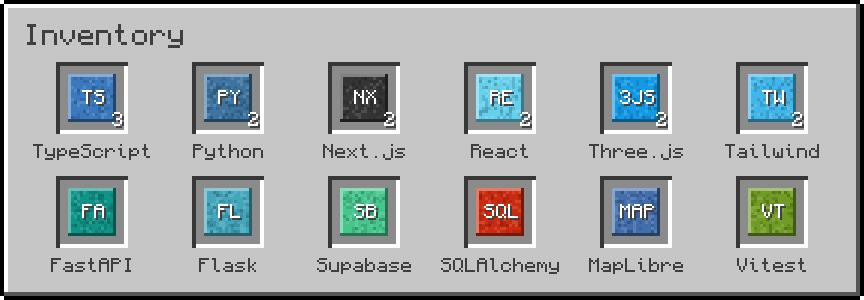
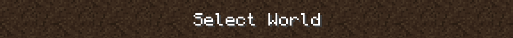
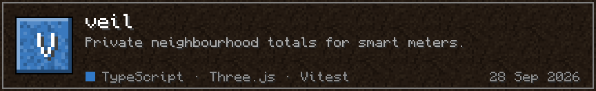
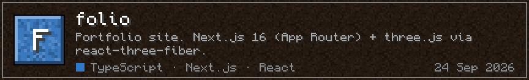
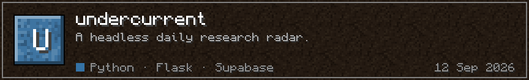
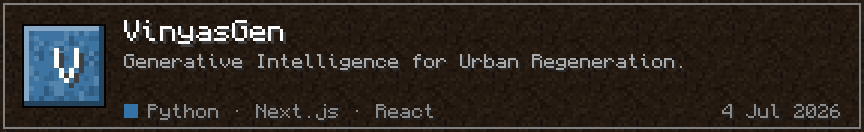
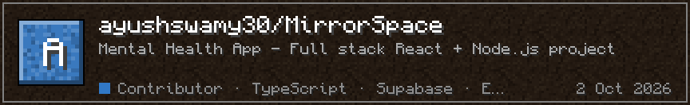
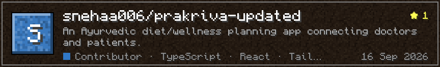
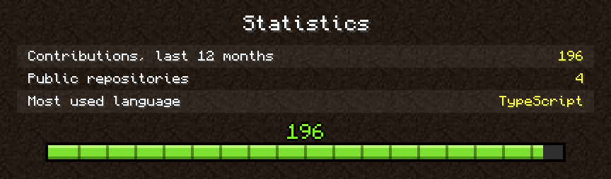

<!-- Generated by scripts/build.py. Change config.json or the script, not this file. -->

Rebuilt daily from live GitHub data by <a href="scripts/build.py">a script</a>. Pixel font: <a href="https://github.com/IdreesInc/Monocraft">Monocraft</a>, OFL.

