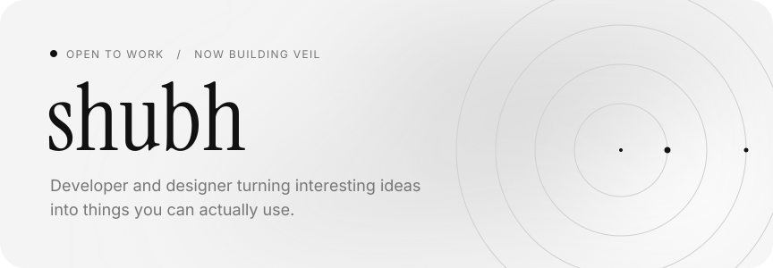
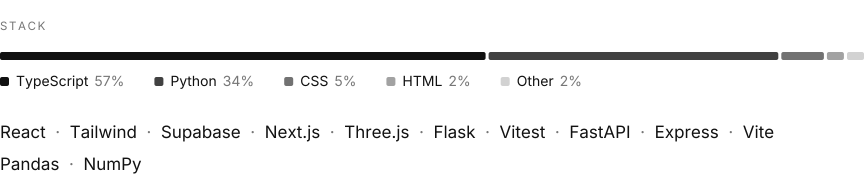
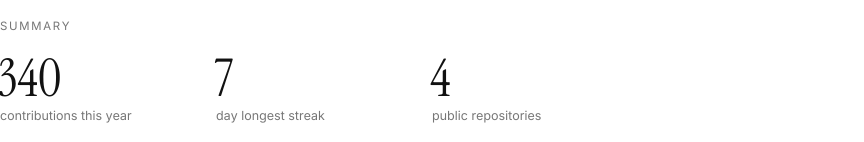
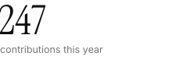
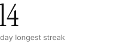
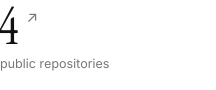
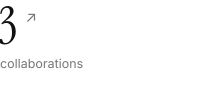
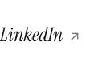

<!-- Generated by scripts/build.py. Change config.json or the script, not this file. -->

<picture><source media="(prefers-color-scheme: dark)" srcset="assets/header-dark.svg"></picture>

<picture><source media="(prefers-color-scheme: dark)" srcset="assets/stack-dark.svg"></picture>

<picture><source media="(prefers-color-scheme: dark)" srcset="assets/summary-dark.svg"></picture>

<picture><source media="(prefers-color-scheme: dark)" srcset="assets/figure-contributions-this-year-dark.svg"></picture><picture><source media="(prefers-color-scheme: dark)" srcset="assets/figure-day-longest-streak-dark.svg"></picture><a href="https://github.com/333shubh?tab=repositories"><picture><source media="(prefers-color-scheme: dark)" srcset="assets/figure-public-repositories-dark.svg"></picture></a><a href="https://github.com/search?q=repo%3Aayushswamy30/MirrorSpace%20repo%3Asnehaa006/prakriva-updated%20repo%3Adhruvv1402/penumbra-nids&amp;type=repositories"><picture><source media="(prefers-color-scheme: dark)" srcset="assets/figure-collaborations-dark.svg"></picture></a>

<a href="https://www.linkedin.com/in/shubhjadiya/"><picture><source media="(prefers-color-scheme: dark)" srcset="assets/link-linkedin-dark.svg"></picture></a>

